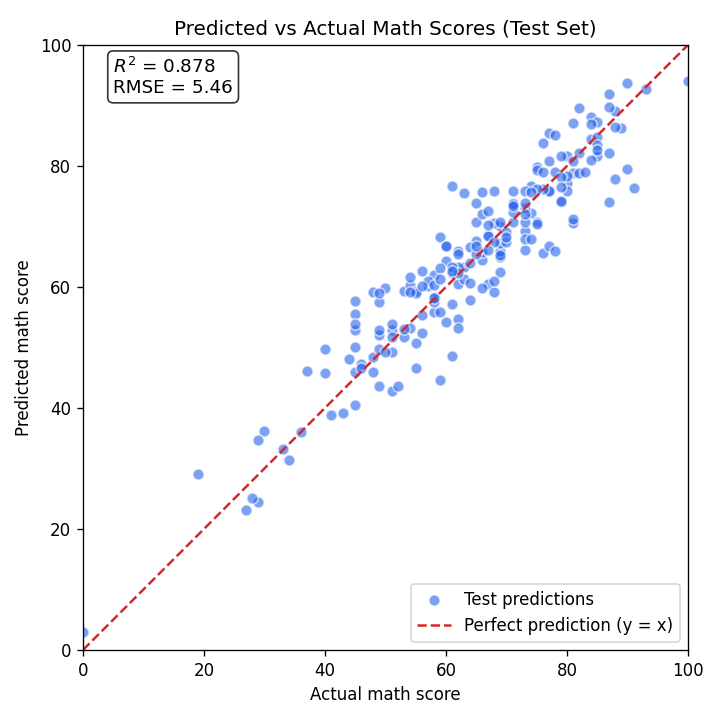

# Student Performance Indicator

An end-to-end machine learning project that predicts a student's **math exam score**
from demographic and academic features. It covers the full lifecycle: data ingestion,
transformation, model training with hyperparameter tuning, a Flask web app for
inference, and deployment to **AWS Elastic Beanstalk**.

## Live Demo

**http://student-perf-env.eba-rf8wmaas.us-east-1.elasticbeanstalk.com** — enter the
student details on the prediction form (`/predictdata`) to get a predicted math score.

## Problem

Given the following inputs, predict the student's math score (0–100):

- Gender
- Race / ethnicity group
- Parental level of education
- Lunch type (standard / free-reduced)
- Test preparation course (completed / none)
- Reading score
- Writing score

## Model Performance

Seven regressors were trained and tuned with `GridSearchCV`; the best model by R²
on the held-out test set was **Linear Regression**.

| Split | R²     | MAE  | RMSE |
|-------|--------|------|------|
| Train | 0.8739 | 4.28 | 5.33 |
| Test  | 0.8775 | 4.25 | 5.46 |

- **R² = 0.88** — the model explains ~88% of the variance in math scores.
- **MAE = 4.25** — predictions are off by ~4.25 points on average.
- Train and test scores are nearly identical → the model **generalizes well** (no overfitting).



Reproduce these numbers and the plot with:

```bash
python evaluate_model.py
```

## Tech Stack

- **ML:** scikit-learn, CatBoost, XGBoost (training); scikit-learn only at serving time
- **Web:** Flask + Gunicorn
- **Deployment:** AWS Elastic Beanstalk (Amazon Linux 2023, Python 3.11)

## Project Structure

```
src/
  components/     data ingestion, transformation, model training
  pipeline/       training and prediction pipelines
  utils.py        save/load objects, model evaluation
  logger.py       logging config
  exception.py    custom exception wrapper
artifacts/        trained model.pkl, preprocessor.pkl, and data splits
templates/        Flask HTML pages
application.py    Flask entry point (WSGI target for Elastic Beanstalk)
evaluate_model.py accuracy metrics + predicted-vs-actual plot
```

## Run Locally

```bash
# create/activate a Python environment, then:
pip install -r requirements-dev.txt   # full training + notebook stack
python application.py                 # serves at http://127.0.0.1:5000
```

To retrain the pipeline end-to-end, run the data ingestion component:

```bash
python -m src.components.data_ingestion
```

## Deployment Notes

- `requirements.txt` is a **slim, Linux-safe runtime set** (Flask, gunicorn, and the
  sklearn stack). The trained model is a sklearn `LinearRegression` and the
  preprocessor is a sklearn `ColumnTransformer`, so `catboost`/`xgboost` are **not**
  needed to serve predictions and are excluded to keep the deploy small.
- The full development environment lives in `requirements-dev.txt`.
- `.ebextensions/python.config` points Gunicorn at `application:application`.
